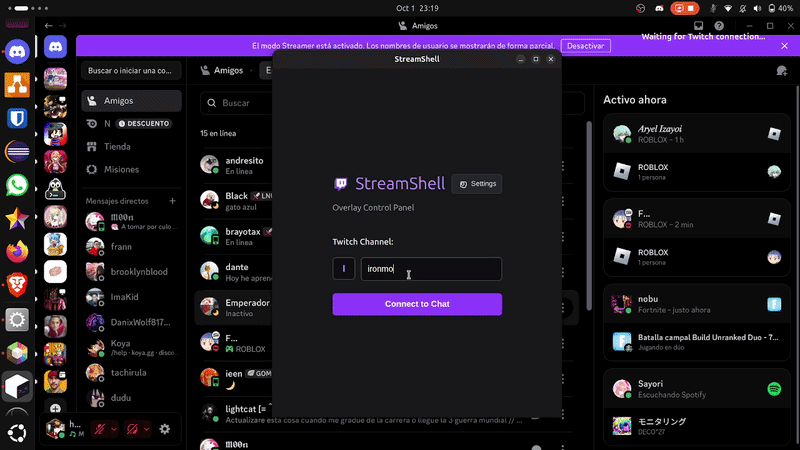
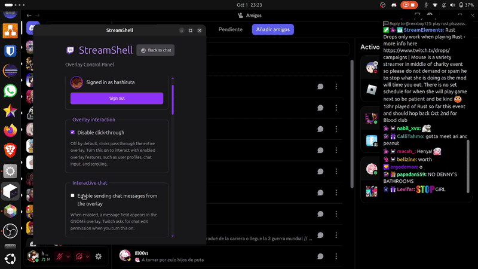
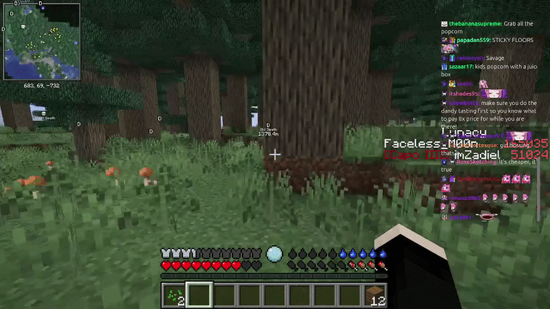

<h1 align="center">
  
</h1>

  
  
  
  
  
  
  
  
  

StreamShell is a Twitch chat overlay for GNOME Shell, with an Electron control
panel for connection and preferences. The Electron main process reads Twitch
chat and resolves assets; the GNOME extension renders the overlay over the
desktop.

### Connect and watch the chat come alive

  

Log in with your Twitch account (not required), choose your channel and see your chat appear right on your screen. Messages show up instantly, complete with Twitch emotes, BTTV, FFZ and 7TV.

### Make it yours

  

Resize the overlay, send messages right from it, adjust the transparency, or hide it with a single click whenever you want.

### Chat that stays out of your way

  

Your chat floats over the game. Perfect if you want to keep up with your viewers on a single screen.

See the [documentation index](./docs/README.md) for installation, development,
research references, and architecture diagrams.
