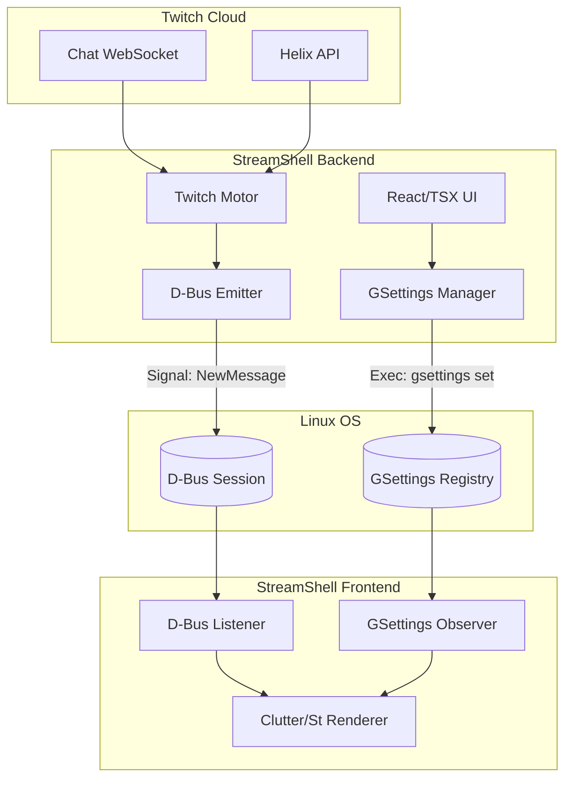

# Component Architecture

This diagram illustrates the macro-level structure of StreamShell. It shows how the Node.js/Electron backend handles the heavy lifting (network, API, IRC) and communicates with the lightweight GNOME Shell extension via native Linux IPC (D-Bus and GSettings).

