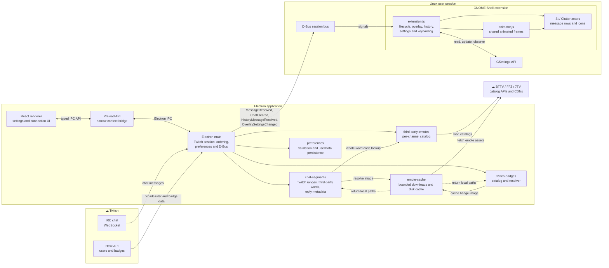

# Component architecture

StreamShell is a multi-process Linux application. The Electron main process
owns networking and application state; the renderer is a control surface; and
the GNOME Shell extension owns on-screen chat rendering. The session bus is the
boundary between Electron and GNOME.

## Ownership and boundaries

- **Renderer:** channel input, connection status, preferences UI, avatar display,
  and user feedback. It does not parse IRC or render chat messages.
- **Preload:** exposes only the app operations and event subscriptions required
  by the renderer; it does not expose raw Node or D-Bus objects.
- **Electron main:** owns the Twitch client, message-ordering chain, in-memory
  chat history, preference validation/persistence, asset downloads, and
  D-Bus signal emission.
- **GNOME extension:** creates/destroys the overlay as the backend bus name
  appears or vanishes, lays out message content, manages history navigation
  and visibility, and bridges D-Bus settings updates to GSettings.
- **Animator:** runs in GNOME Shell, not Electron. It decodes local animated
  assets and coordinates frame redraws with overlay visibility.

Chat payloads and image paths cross D-Bus. Image bytes and HTTP requests stay
in Electron. GSettings belongs to GNOME Shell; Electron does not modify its
registry directly.

## Main D-Bus contract

The main process owns `org.streamshell.Twitch` and exports the chat interface
at `/org/streamshell/Twitch/Chat`. Signals used by the overlay include:

| Signal | Purpose |
|---|---|
| `MessageReceived` | One live message, including author, color, and JSON-encoded badges/segments/reply data |
| `ChatCleared` | Reset visible/session chat state on a new channel or disconnect |
| `HistoryMessageReceived` | Replay an in-memory message while the user navigates history |
| `OverlaySettingsChanged` | Send overlay-related preferences to the extension |

The third `MessageReceived` argument remains a string at the D-Bus type level;
its JSON payload is an application-level contract. Keep the sender, extension
parser, and these docs in sync when changing that shape.

## Failure containment

- Failed catalog or image requests degrade emotes to text or a static asset;
  they do not move network retrieval into GNOME.
- A malformed rich payload or row-layout failure falls back to readable text.
- If the session-bus service cannot initialize, the control panel can still
  start, but the GNOME overlay bridge is unavailable; the backend logs the
  setup failure.
- When the Electron bus name disappears, the extension hides the overlay and
  releases session-owned UI state.
