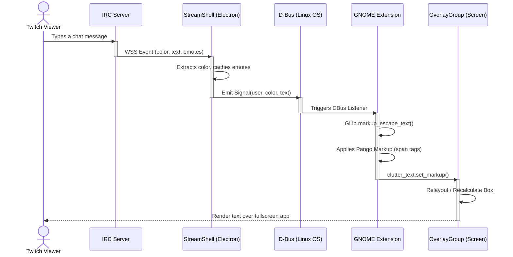

# Message Sequence Flow

This sequence diagram details the critical path of a chat message. It maps the journey from the moment a viewer types in Twitch, through the Electron backend sanitization, across the D-Bus system, and finally rendering on the GNOME OverlayGroup (bypassing full-screen games).

