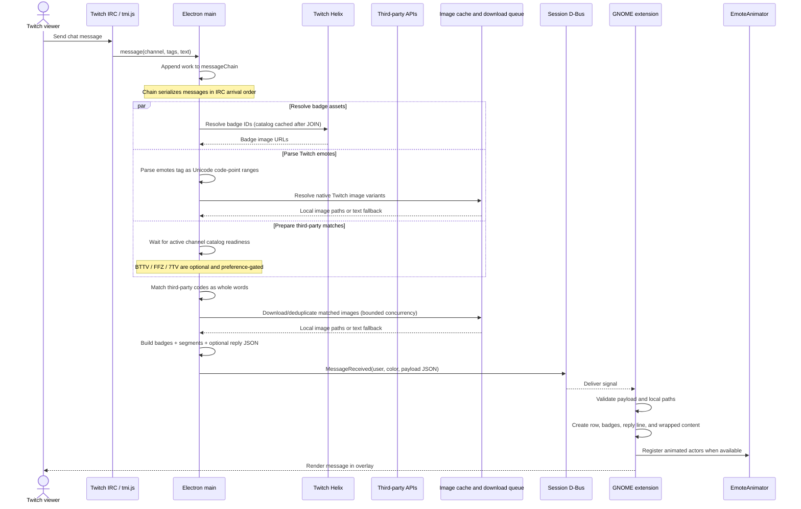
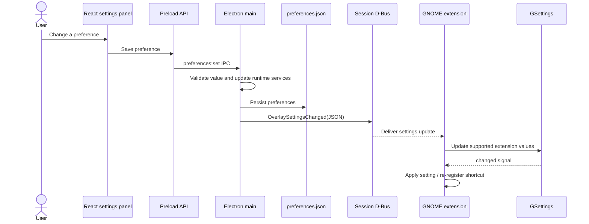

# Message and settings sequences

## Live message: IRC to overlay

This sequence includes the asynchronous work that must finish before a message
is emitted, while preserving the order in which Twitch delivered messages.

If an asset is unavailable, the segmenter keeps its emote code as text. If the
extension cannot build the rich row, it renders a text fallback. These fallbacks
preserve message content and do not retry by issuing network requests from
GNOME Shell.

## Preference update: panel to extension

Not every app preference belongs to GNOME. For example, download concurrency
and third-party catalog support are backend settings; overlay appearance,
animation, history, and the global shortcut are consumed by the extension.
Refer to [deployment and use cases](./05-deployment-and-use-cases.md) for the
process boundary and [runtime states](./04-runtime-pipelines-and-states.md)
for lifecycle constraints.
