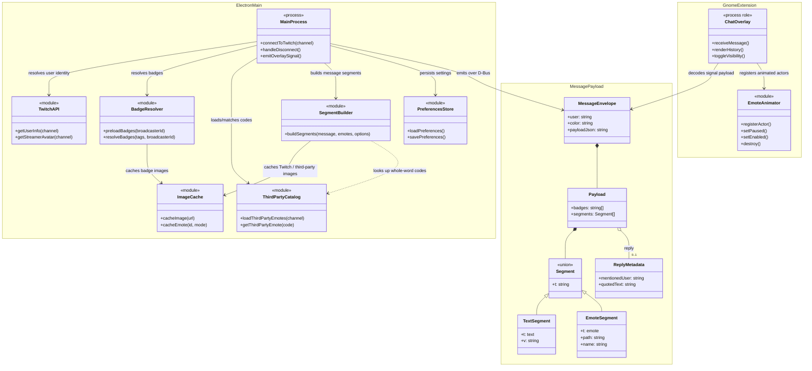

````markdown
# Runtime roles and message data model

The earlier diagram implied an inheritance hierarchy and a D-Bus proxy class
that do not exist in the implementation. This view instead documents the
module/service relationships and the message data contract. Elements marked
with stereotypes are architectural roles, not claims that each module exports
a TypeScript class.



## Data and lifecycle ownership

| Data | Owner | Lifetime |
|---|---|---|
| Preferences | Electron main | Persistent in Electron `userData` |
| Image files and missing-animation markers | Electron image cache | Persistent in the platform cache directory |
| Avatar lookup cache | Renderer local storage | Persistent and separate from the image cache |
| Twitch client, broadcaster ID, badge indexes, third-party catalog, message chain | Electron main | Process/channel session |
| Chat history | Electron main | In memory, capped at 500; reset for channel change/disconnect |
| Overlay actors, scroll position, visibility, animator state | GNOME extension | Extension/backend session |
| Animation and shortcut settings | GNOME GSettings | GNOME user settings |

The D-Bus wire signature for a live message remains a tuple of strings. The
third string is JSON with badge paths, segment records, and optional reply
metadata. The class view uses the implementation's conceptual contract fields;
it does not imply a separate runtime `MessageEnvelope` class. Do not treat the
JSON as a generic Pango markup string: the extension creates actors from
validated local paths and text values.
````
