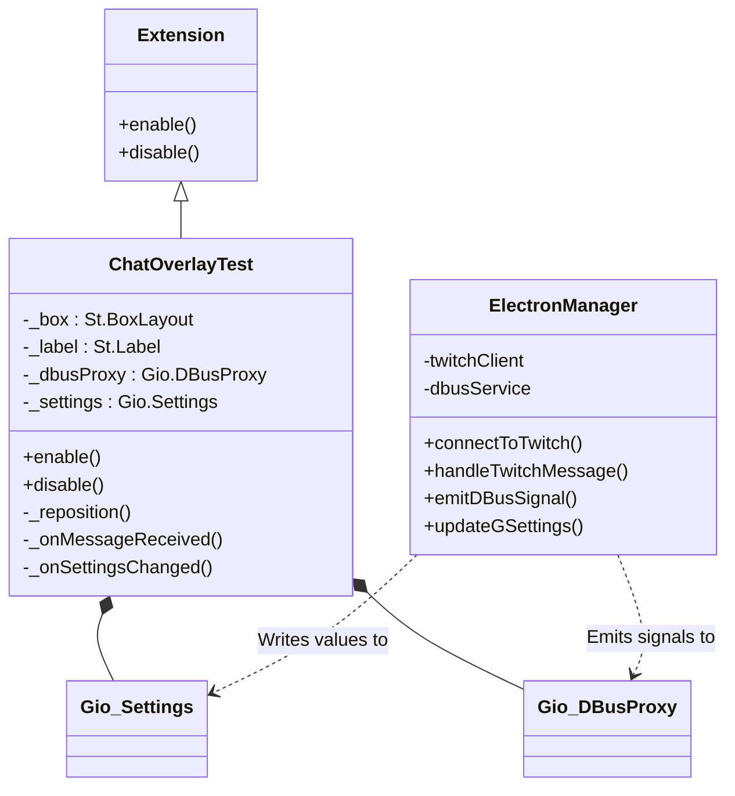

# Class Structure

This diagram shows the internal object structure. It highlights how the main GNOME extension class inherits from the native module and instantiates proxy objects to listen to the Electron manager.

