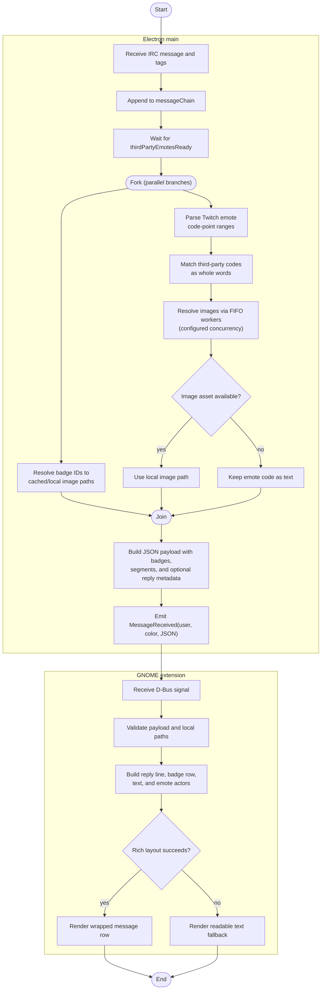
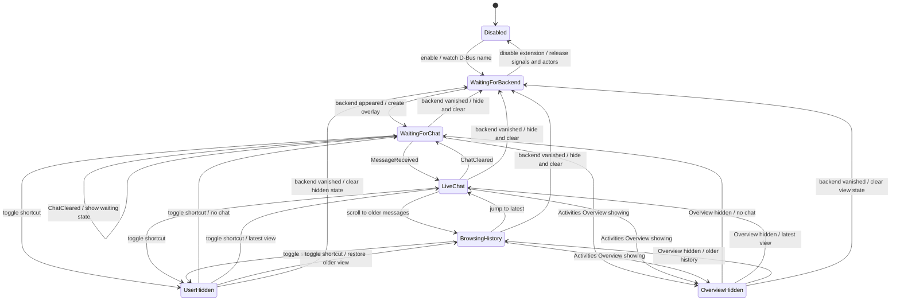
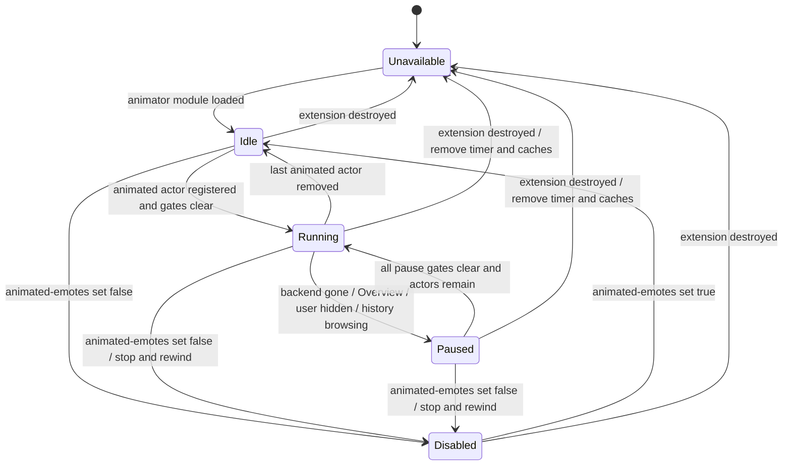

# Runtime pipelines and state machines

This document covers two critical areas not visible in the component view:
the asynchronous message/asset path and the state conditions controlling the
overlay and animated emotes.

## UML activity: ordered message delivery

After JOIN, broadcaster lookup starts badge preload and optional third-party
catalog loading concurrently. The BTTV, FFZ, and 7TV requests also run
concurrently, each with a 15-second request timeout. Messages wait for the
third-party catalog-loading task to settle before segment construction.

The worker count bounds simultaneous image downloads; the queue is FIFO and
same-URL requests share an in-flight promise. The 30-second abort is an idle
timeout that resets on data progress, not a total-download deadline. Separately,
`messageChain` serializes message emissions so a later fast message cannot
overtake an earlier slow one. A slow asset can therefore delay its message and
subsequent D-Bus emissions while other admitted downloads continue.

## UML state machine: extension and overlay lifecycle

The extension stays enabled when the Electron app is closed, but it creates no
visible overlay until the backend owns the session-bus name. The Overview and
the user's toggle shortcut are independent visibility gates.

Shortcut/Overview transitions are orthogonal in the implementation to the
content mode; this compact state view shows the principal transitions, not a
full Cartesian product of visibility and history states. Returning from the
Overview restores the applicable waiting/live/history view.

## UML state machine: animated emote scheduler

The extension's animator is a resource scheduler, not a per-image timer. A
single GLib source advances shared decoded animations; gates pause work when
animation should not be visible or consumed.

If the animator cannot load or a specific asset is unsupported, the extension
still renders a static icon where possible. The `Unavailable` state does not
disable chat rendering.

