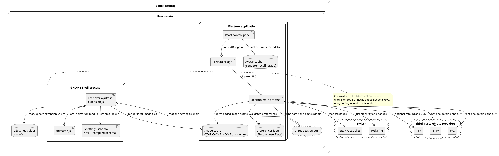
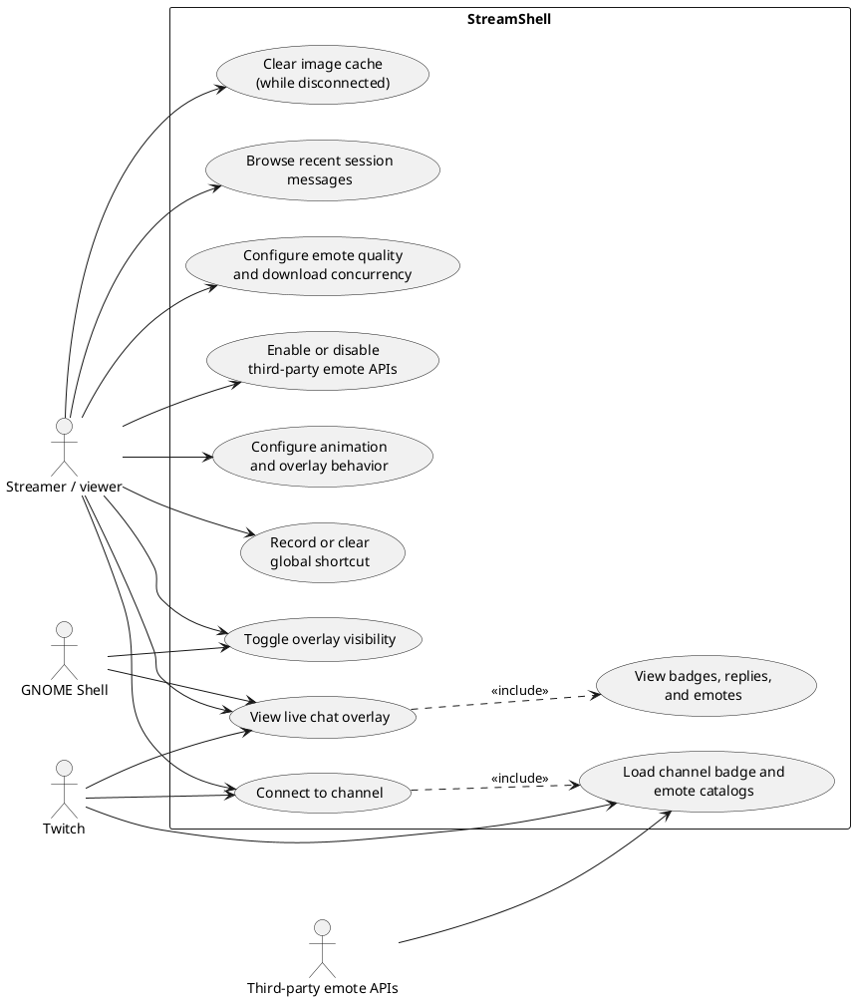

# Deployment and user use cases

This document adds deployment and use-case views to the component, message
sequence, class/data, activity, and state-machine diagrams. It describes the
Linux desktop deployment target; StreamShell does not run the overlay inside
the Twitch website or Electron renderer.

## UML deployment diagram

The Electron app and GNOME Shell extension are separate processes in the same
user session. The extension reads downloaded image files by local path; it
does not download them itself. The session bus is the runtime bridge, while
settings are persisted through the relevant owner: Electron `userData` for
app preferences and GSettings for extension settings.

## UML use-case diagram

The global shortcut is registered by GNOME Shell, so it can toggle the overlay
without Electron having focus. Super/Windows is reserved, and some key
combinations may be intercepted by the desktop environment. Cache clearing is
not available while a Twitch session is connected.

## Applying the diagrams

- On **X11 and Wayland**, Electron and the extension communicate over the same
  session bus. On Wayland, extension code/schema changes require a new Shell
  session; ordinary preference changes are live after the extension has loaded
  the relevant schema keys.
- A missing external provider or network path affects catalog/image loading,
  not extension deployment. Emote text remains visible when an image cannot be
  resolved.
- The deployment does not include a remote server or a persistent chat
  database. Message history is bounded in-memory session state.
